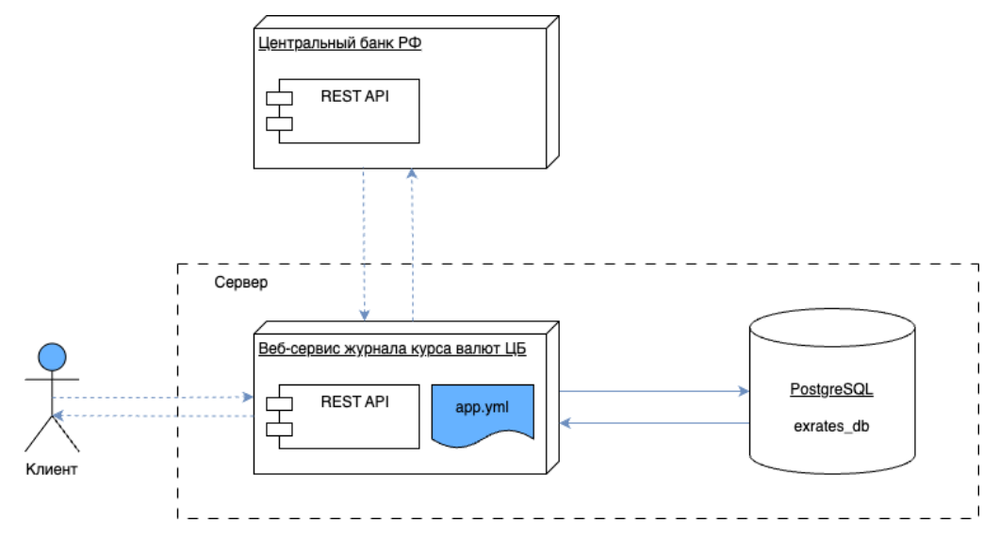

# Журнал курса валют ЦБ
Приложение разрабатывается на стороне сервера с целью сбора актуальных данных 
курса валют по дате и времени Центрального банка Российской Федерации.

Приложение предназначено для:
- сбора и учета актуальных данных курса валют ЦБ;
- справочной информации носителям валюты, а именно их странам.
___
## Основные функции приложения
- автоматическая синхронизация курса валют с ЦБ по расписанию;
- ручной запуск синхронизации курса валют с ЦБ;
- чтение журнала с фильтрацией, пагинацией и сортировкой по параметрам;


___
## Запуск программы
Для работы программы требуется БД с названием `Journal`
После создания БД, в папке `/src/main/resources` создать 
файл конфигураций `application-dev.yaml` подставив свои
данные пользователя БД:
```yaml
datasource:
  username: 
  password: 
```


Для сборки проекта ввести команду `mvn clean install -DSkipTests`

Чтобы запустить программу, необходимо перейти в папку `target`
и ввести команду `java -jar ExchangeRateJournal-0.0.1-SNAPSHOT.jar`
___
## Использование программы
Перейти по ссылке: http://localhost:8088/journal/update для 
запуска ручного обновления курса валют